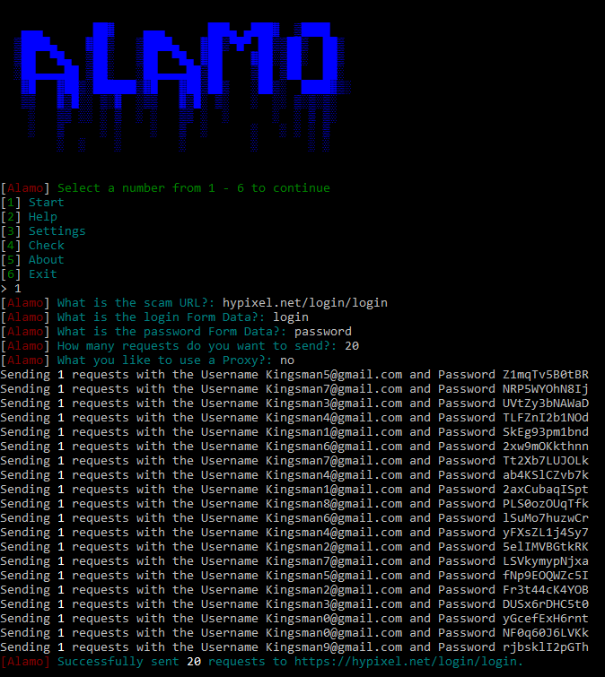

# Alamo
Alamo is a piece of software written in Python and is used to send spam login requests to a website. It is intended for use on scammers' websites.
<br>


## Installation

```console
# clone the repo
$ git clone https://github.com/xkwm1/Alamo.git

# change the working directory to sherlock
$ cd alamo

# install the requirements
$ python3 -m pip install -r requirements.txt
```

[](https://ssh.cloud.google.com/cloudshell/editor?cloudshell_git_repo=https%3A%2F%2Fgithub.com%2Fxkwm1%2FAlamo&cloudshell_git_branch=main)

## Contributing
Thank you for thinking about contributing towards Alamo. Each and every contribution is greatly valued!\

Here are some things we would appreciate your help on:
- Bugs in Alamo
- Spelling errors and weird font textures
- Removing lines of code that is unnecessary or unused

## License

Apache 2.0 © Alamo<br/>
Read here: [LICENCE](https://github.com/xkwm1/Alamo/blob/main/LICENSE)
